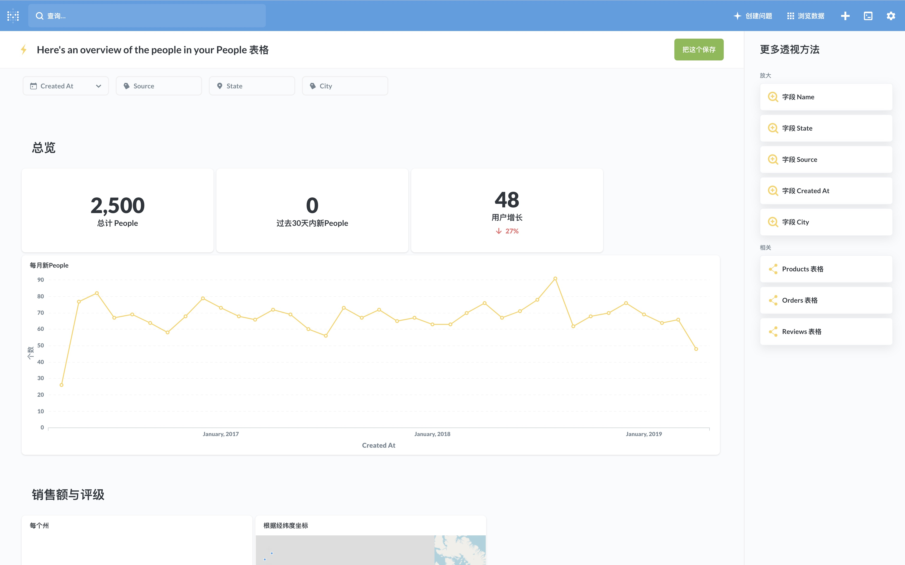

  

# [Metabase](https://github.com/metabase/metabase)

Metabase 是一个简单、开源的 BI 工具，Metabase 可以帮助你把数据库中的数据更好的呈现给更多人，通过建立查询来提炼数据，并通过仪表盘来组合展示。

## 部署

本项目基于开源项目 [CloudBase Framework](https://github.com/Tencent/cloudbase-framework) 开发部署，支持一键云端部署

### 配置

- `MB_DB_DBNAME`：数据库名，默认为 metabase
- `MB_DB_PORT`：数据库端口
- `MB_DB_USER`：数据库用户名
- `MB_DB_HOST`：数据库 Host
- `MB_DB_PASS`：数据库密码

### 依赖

- CynosDB：使用 CynosDB 数据库存储数据
- CFS：需要使用 CFS 持久化配置数据

## 注意事项

1. 部署时，需要将服务路径设置为根路径 `/`
2. Metabase 对容器配置要求较高，默认使用 1C2G 的配置，在进行大量计算时，可能需要更高的配置
